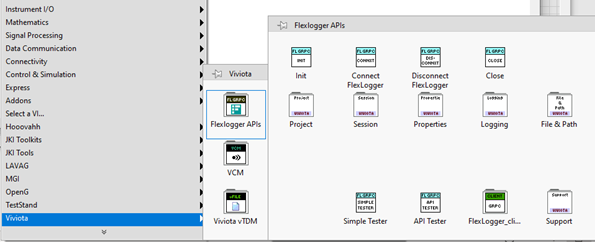
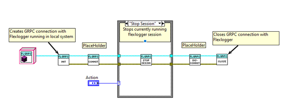

## About
Viviota **Flexlogger** package contains an API (Application Programming Interface) and examples for using gRPC to automate the [FlexLogger](https://ni.com/flexlogger).
The automation API supports modifying the configuration of existing FlexLogger projects and controlling the execution of FlexLogger tests.

## Requirements
**viv-flexlogger-apis** has the following requirements:
- FlexLogger 2023 Q2+
- LabVIEW 2020+
- GRPC Modules from NI (Installed along with this package).
- VIPM (to Install package)

## Installation
- Install viviota_lib_flexlogger_apis-1.0.0.1.vip using VIPM.
   
  **Note**: It installs NI gRPC modules along with this package as dependencies.
 
## Palette
- After Installing the package, APIs can be found in the following Location.
   
   `(Viviota >> FlexLogger APIs)`
  

    

## Using the FlexLogger APIs

- Use `(Viviota>>Flexlogger APIs>>Init.vi)` to connect with the Flex logger application in the local system.
- Then open the existing project using `(Viviota>> Flexlogger APIs>>Project>>Open Flexlogger project.vi)`.
- If the project is already opened in the flex logger, use `(Viviota>> Flexlogger APIs>>Project>>Get a current project.vi)` to reference it for upcoming APIs.
- Then, call APIs based on use cases.
   - Eg: To Start test session from currently open project. Call `(Viviota>> Flexlogger APIs>>Session>>Start Test.vi)`.
- Refer to **Simple Test.vi** to Start/Stop the session in flexlogger. (Flexlogger should be loaded with the project file before executing this VI).
    

